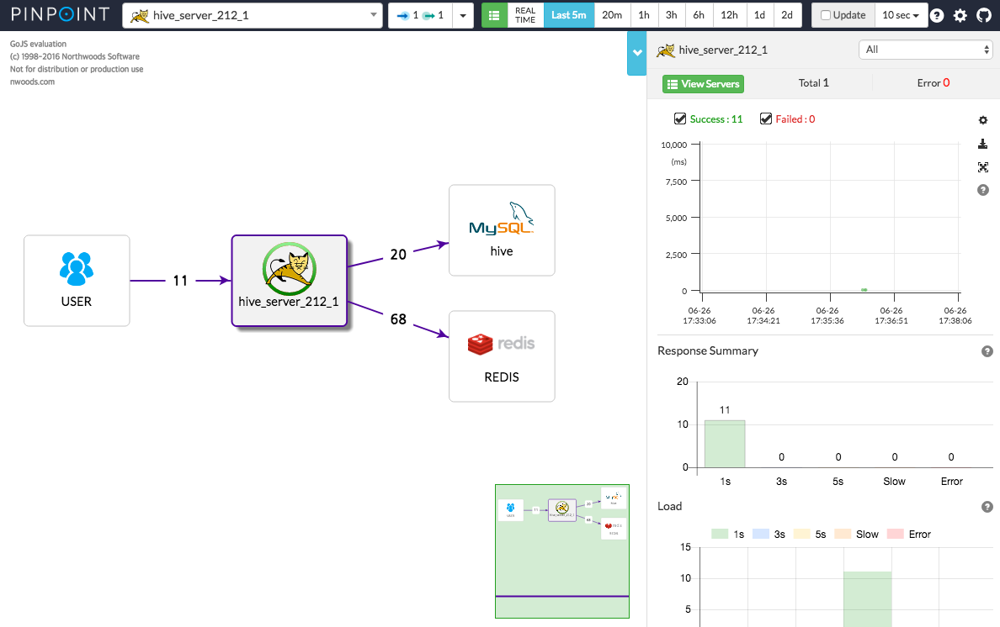

# pinpoint-single-docker



[Pinpoint](https://github.com/naver/pinpoint)는 대규모 분산 시스템의 성능을 분석하고 문제를 진단, 처리하는 플랫폼입니다. 네이버의 pinpoint를 clone하면 기본적으로 quickstart를 통해 단일 머신에서 간단히 pinpoint를 구동시키고 사용할 수 있습니다. 

단일 머신에서 구동되는 pinpoint에서는 hbase의 저장소로 HDFS가 아닌 로컬 파일 시스템을 사용합니다. 그러므로 하둡이 필요 없고 hbase에 내장된 주키퍼를 사용하기 때문에 주키퍼를 따로 설치할 필요가 없습니다.

구동을 위해 필요한 이미지들은 제 개인 repository에 push를 해두었습니다. 기본적으로 docker-compose.yml에서는 아래의 repository 이미지를 사용합니다.

* [yonghochoi/pinpoint-hbase](https://hub.docker.com/r/yonghochoi/pinpoint-hbase/)
* [yonghochoi/pinpoint-collector](https://hub.docker.com/r/yonghochoi/pinpoint-collector/) (버전 : 1.6.2)
* [yonghochoi/pinpoint-web](https://hub.docker.com/r/yonghochoi/pinpoint-web/) (버전 : 1.6.2)


## 컨테이너 구동

컨테이너 구동을 위해서 docker-compose를 사용합니다. 설치가 되어 있지 않다면 [Install Docker Compose](https://docs.docker.com/compose/install/)를 통해 설치 후에 진행을 하셔야 합니다.

기본 설정 그대로 구동 시에는 아래 명령을 사용하여 구동합니다.

```shell
$ docker-compose up -d
```


해당 repository를 수정하여 구동하길 원하는 경우 Dockerfile을 수정한 후에 docker-compose.yml 파일을 수정하여 image로 되어 있는 부분을 아래와 같이 build로 변경 후 경로를 지정합니다.

```yaml
version: '2'
services:
  hadoop:
    container_name: hadoop
    hostname: hadoop
    # image: yonghochoi/hadoop
    build: hadoop
    restart: always
    expose:
      - "9000"
    ports:
      - "9000:9000"
```


변경된 Dockerfile을 적용하기 위해 아래 명령을 수행합니다.

```shell
$ docker-compose build
```


적용된 Dockerfile을 통해 컨테이너를 구동시키기 위해 아래 명령을 수행합니다.

```shell
$ docker-compose up -d
```


## 오류가 발생하는 경우

docker-compose를 사용하여 컨테이너가 구동되는 과정에서 hbase가 완전히 준비되지 않은 상태로 pinpoint-collector 또는 pinpoint-web이 구동되면 제대로 동작되지 않는 경우가 있습니다. 

이러한 경우에는 각 컨테이너를 순차적으로 실행을 시켜주면 정상동작합니다. 아래와 같은 순서로 진행해보시길 바랍니다.

1. Pinpoint-collector/web/hbase 종료

   ```shell
   $ docker stop pinpoint-collector
   $ docker stop pinpoint-web
   $ docker stop pinpoint-hbase
   ```

2. hbase 구동 및 로그 확인

   ```shell
   $ docker start hbase
   $ docker logs -f hbase
   ```

   - Entrypoint에 의해서 컨테이너 구동 시 테이블 생성을 시도하게 됩니다.
     - 이미 테이블이 생성되어 있는 경우에는 테이블 생성을 skip 합니다.
   - 테이블 생성 절차가 완료되고 정상 동작까지 로그를 확인 후 아래과정 수행

3. pinpoint-collector 구동 및 로그 확인

   ```shell
   $ docker start pinpoint-collector
   $ docker logs -f pinpoint-collector
   ```

   - Exception이 발생하지 않고 정상동작하는 지 확인

4. pinpoint-web 구동 및 로그 확인

   ```shell
   $ docker start pinpoint-web
   $ docker logs -f pinpoint-web
   ```

   - Exception이 발생하지 않고 정상동작하는 지 확인


## 참고

- [Pinpoint](https://github.com/naver/pinpoint)
- [대규모 분산 시스템 추적 플랫폼, Pinpoint